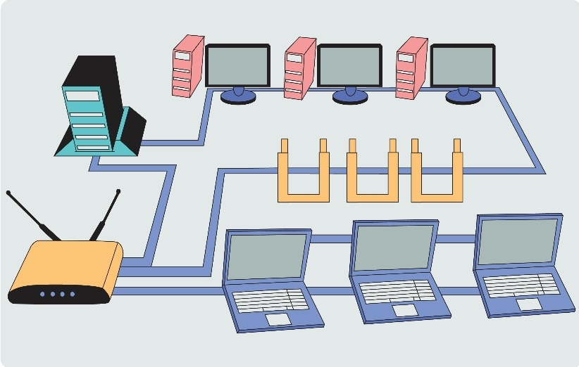
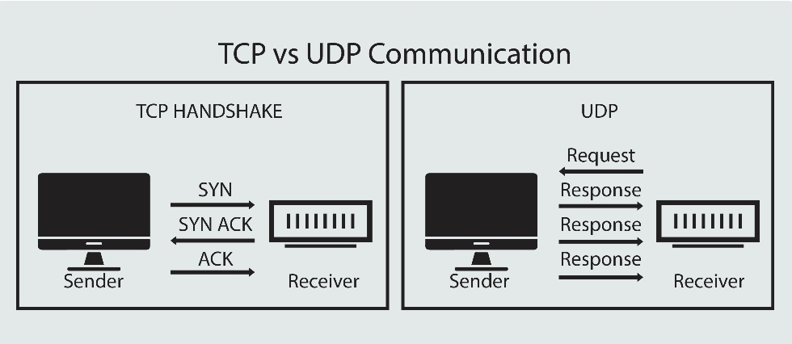
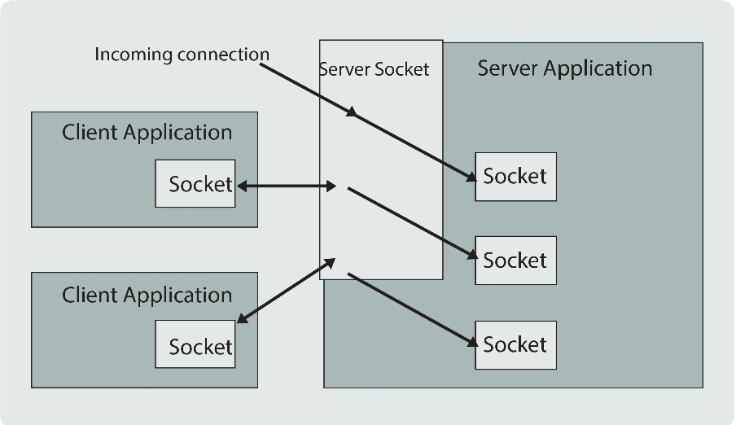
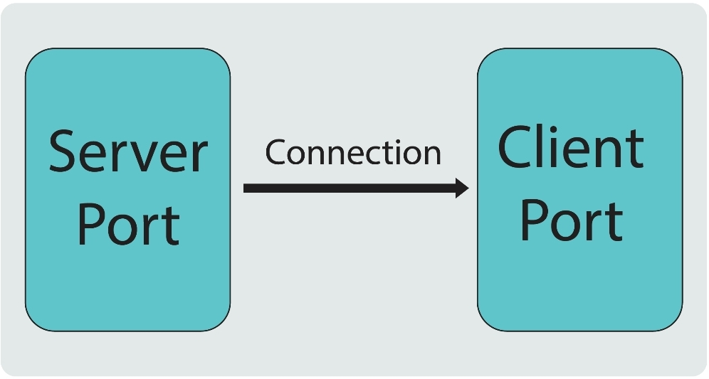

# Network-programming-java-journey-4

Have you ever used an online customer support chat system? The user at his place can get in touch with the customer support team in no time, communicate, and get their problem solved. This is possible via the network  where the user is referred to as the client and the application from where he has been communicating is the server.
We can create such system using Java with the help of the concepts called Network or Socket Programming.
Java provides a colection of classes and interfaces that take care of low-level communication details between the client nd the server, and provide a powerful infrastucture for networking. These are mostly contained in the java.net package.
In Java.net.Socket class represents a client socket, and the java.net.Server.Socket class provides a mechaninsm for the server program to listen for clients and establish connexn with them. e.g. ServerSocket server = new ServerSocket(5000);
Here, the app. attempts to create a server socket that is bound to the specified port. Also, we can specify the backlog parameter that determines howmany incoming clients to store in a wait queue.
-> int getLocalPort(): It returns the local port number to which  the specified socket is bound, that is the port on which the server socket is listening on.
-> Socket accept(): It is used to accept the incoming request to the socket. When the ServerSocket invokes accept().
-> void bind(SocketAddress host, int backlog): It binds the serversocket to the specified socket address, that is IP address and the port number. If the specified address is null the system will automatically pick up an ephemeral port and valid local address to bind this socket.
To have a lens, explore code sections!

# CN essentials
Computer networks run our world. From banks and schools to business, virtually every system or process in todays world is affected or run by a computer network.
By definition, a comuter network is a group of computer that are linked together through a communication channel. The Internet is a kind of computer network.
Computer network all follow certain rules of communication when sending info. back and forth. These are called network protocols which are jsut like traffic rules that we follow in order to achive a safe and continous flow of vehicles on the road.
Network protocols also provide the means by which computers can identify each other on a netwrok. The size and purpose of the network will determine what type of netwrok protocol is used.

-> IP Address: It is an unique number assigned to every device connected to a network that uses the Internet Protocol for communication. Each IP Address identifies the device's host network and the location of the device on the host network.
-> Nodes: A node is a connection point inside a network that can receive, send, create, or store date. Each node requires you to provide some form of identification to recive access, like an IP address.
-> Routers: It is a physical or virtual device that sends the imfo. contained in date packets between N/Ws. It analyzes data within the packets to determine the best way for the info. to reachits ultimate destination.

-> Port: It identifies a specific connec. b/w N/W devices. Each port is identified by a number called port number. It's a virtual point where n/w connec. start and end.
-> TCP & UDP (y'll know that very well)!
To Conclude: CN connect nodes like computers, routers and switches using cables, fiver optics, or wireless signals. These connections allow devices in a n.w to communicate and share info. and resources.
N/Ws follow protocols, which define how communication are sent and received. Each device on a n/w uses an IP, with that basic idea abt. how a n/w works under the hood, we are ready to move ahead and explore the world of networking using java!!
# Socket Programming

N/W programming is also know as Socket Programming in java because it depends upon the sockets for connection and communication. It boils down to two systems communicating with one another. In simple words. It is a means of communicating data between two computers across a n/w. These connec. can be made using dither TCP or UDP. In my case i will use TCP/IP which is connexn. oriented protocol (reliable one)
-> In UDP there is no sessionb/w the client and the sever while in TCP and exclusive coonexn must be established b/w client and server for communication to take place.
Socket are categorized in two types: 1) A server socket    2) A client socket

